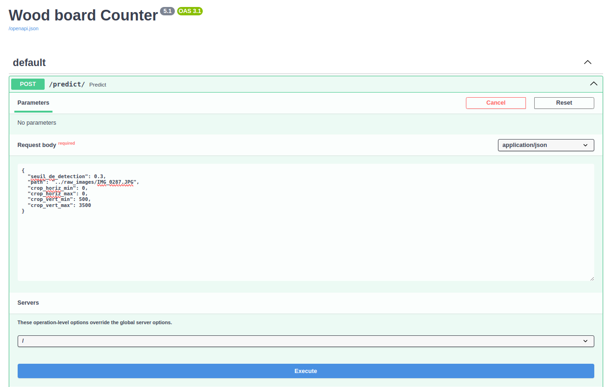
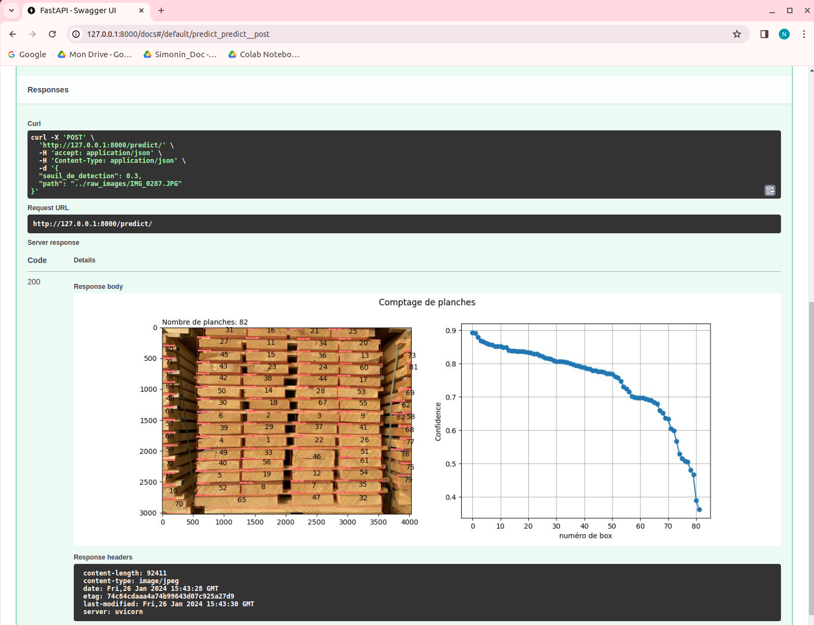

Board_Counter

This github repo is a a MLOps exercice to deploy a computer vision Machine Learning Application to count the number of woodboards on an image.
It uses:
1. Roboflow to annotate specific images
2. Ultralytics Yolov8 to train model
3. FastAPI to deploy a user interface (you can also use predict.ipynb notebook to make prediction)

