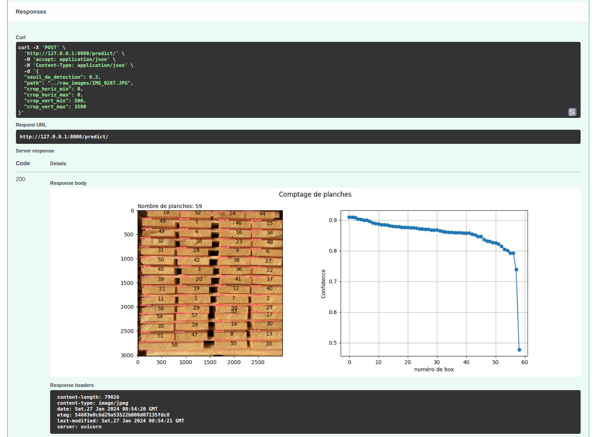

Board_Counter

This github repo is a a Supervised Machine Learning Project to deploy a computer vision Application capable of counting the number of woodboards on an image.

It goes through all steps of a machine learning project, using different tools:
1. Jupyterlab notebook to prepare images
2. Roboflow to annotate images
3. Ultralytics Yolov8 to train model on specific images
4. FastAPI and uvicorn to deploy a user interface
5. Docker to create and deploy a container running this app on other computer

